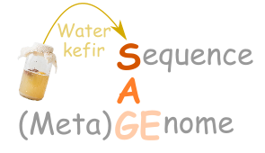

# Course Overview: **S**equence **A** (meta)**GE**nome with Water Kefir

**S**equence **A** (meta)**GE**nome (SAGE) is a year-long Master's course at the University of Lausanne. In this course, Master students get a hands-on training in bioinformatics and microbial genomics by sequencing and comparing genomes of bacteria that have not been studied before! The course concept is training-through-research. Every year we study a different subject. This course was done on water kefir.

## Repository Overview

This course is taught over two semester (SAGE1 and SAGE2) and is structured into two main components: theoretical lectures and hands-on practical sessions.

### Lectures

The lectures cover the following topics:

1. SAGE 1: Lecture 1: Introduction
2. SAGE 1: Lecture 2: Genome Assembly
3. SAGE 1: Lecture 3: Recap
4. SAGE 1: Lecture 4: Wrap-Up (Illumina)
5. SAGE 1: Lecture 5: Final Remarks
6. SAGE 2: Lecture 1: Outline
7. SAGE 2: Lecture 2: Diversity Analysis
8. SAGE 2: Lecture 3: Microbial Ecology 2023

### Practicals

Each practical includes an Rmarkdown (.Rmd) file and a pre-generated HTML output for convenience. The topics covered are:

1. SAGE 1: Tutorial 1: Unix
2. SAGE 1: Tutorial 2: Cluster Computing
3. SAGE 1: Tutorial 3: Illumina QC
4. SAGE 1: Tutorial 4: Genome Assembly
5. SAGE 1: Tutorial 5: Read Mapping
6. SAGE 1: Tutorial 6: ONT Filtering
7. SAGE 1: Tutorial 7: ONT Assembly
8. SAGE 1: Tutorial 8: Annotation
9. SAGE 2: Tutorial 9: 16S rRNA Tutorial (DADA2, GSL)
10. SAGE 2: Tutorial 10: ASV-Isolate Matching
11. SAGE 2: Tutorial 11: 16S Diversity Analysis (JTEU)
12. SAGE 2: Tutorial 12: MAGs Binning

## Data Availability

All data analyzed and created for this course is stored on Zenodo under the following DOI:

- DOI placeholder

The genomic data is further stored under the following Bioprojects:

- [Bioproject placeholder](https://www.ncbi.nlm.nih.gov/bioproject/PRJNA717134)
- [Bioproject placeholder](https://www.ncbi.nlm.nih.gov/bioproject/PRJNA1048529)
- [Bioproject placeholder](https://www.ncbi.nlm.nih.gov/bioproject/PRJNA1083966)

## Course instructors and code contributors

- Aiswarya Prasad
- Daniel Garrido-Sanz
- Garance Sarton-Lohéac
- German Bonilla-Rosso
- Florent Mazel
- Lucie Kesner
- Malick Ndiaye
- Philipp Engel
- Vincent de Bakker
- Vincent Somerville
- Vladimir Sentchilo
- Yassin El-Chazi

## Citation

This course repository corresponds to the following manuscript:

Vincent Somerville, … Garance Sarton-Lohéac, Vincent de Bakker, Yassin El-Chazi, Lucie Kesner, Malick Ndiaye, Daniel Garrido-Sanz, Aiswarya Prasad, German Bonilla-Rosso, Florent Mazel, Vladimir Sentchilo, Sylvain Moineau, Corinne F Maurice, SAGE course students 21/22 and 22/23, Philipp Engel 2024. “Strain-level and phenotypic stability contrasts with plasmid and phage variability in water kefir communities” *BioRXiv*

## Disclaimer

This course repository is not exhaustive but serves as a guide and a blueprint to inspire others.
